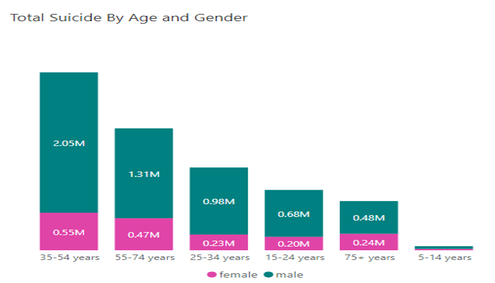

# Global Suicide Rates (1985 - 2020)
> "Creating Hope Through Action" Theme 2020 - 2023

## Introduction

Suicide is the act or an instance of taking one's own life voluntarily and intentionally (Meriam-Webster Dictionary).

According to WHO, More than 700 000 persons die by suicide every year globally. Suicide is the fourth leading cause of death among 15-29 year olds.
This is a power Bi project on suicide global rates. The aim of the project is to analyse and derive insights with regards to suicide and see how we can help resolve the menace.

**NB** : _The data is derived from a [Kaggle](https://www.kaggle.com/datasets/omkargowda/suicide-rates-overview-1985-to-2021) dataset_

## Data Definition
Our dataset downloaded from kaggle contained :
- country
- year
- sex
- age
- suicides_no
- population
- suicides/100k pop
- country-year
- HDI for year
- gdp_for_year
- gdp_per_capita
- generation
## Problem statement
1. Is there any variation of suicide by gender? How has this evolved over time?
2. Which age group is more vulnerable to suicide?

3. How do different regions and countries vary in terms of suicide rate?
4. Which countries have consistently had high suicide rates?

5. Over the years has there been a rise or decrease of suicide cases? Have there been noticable changes or spikes during certain years?
6. Are there countries which have successfully reduced their suicide rates over time?

7. What's the average suicide rate globally?
8. Is it possible to predict future rates?
## Technologies used
Data was cleaned in Excel and uploaded to PowerBi.
Some of the skills used include: 
- DAX,
 - quick measures, 
 - Filters

## Data transformation
Data was loaded into the powerquery editor and an overview of the columns was checked.
There were 31756 rows and 12 columns. Some of the columns contained null values.
The data types were changed accordingly.

The country column had no null values and no errors the data type is text.

the hdi column had 19456 empty rows and as this would greatly influence our results the column will be dropped.

The column hadd 1200 empty rows. The empty rows were removed.
Since we had the country and year column the country-year column was dropped

A new column for region was added to divide the countries to continents
The rows with United States were made to United States of America,  Czechia Republic and Czechia were made to Czechia, Saint Vincent and Grenadines was made to Saint Vincent and the Grenadines for uniformity
## Data Analysis and Visualization
#### Is there any variation of suicide by gender? How has this evolved over time?

As seen in the data, men have almost 3 times risk of dying by suicide as compared to women.
This trend is observed across all age groups and over time

Apart from 2016, where all seemed to have a sudden dip. There has been a radual increase of suicide.

#### Which age group is more vulnerable to suicide?

The age group 35-54 has the highest record of cumulative  deaths

When the rate is considered using suicide by 100k population. The age group 75+ has the highest rates

Region with highest 75+ suicides
#### How do different regions and countries vary in terms of suicide rate?

Europe seems to have the highest suicide rates at around 3.6 million deaths while Africa seems to have the least at around 13,000. This does not accurately represent the reality in the African countries since only 5 African countries had data.

The Republic of Korea has the highest suicide rates

#### Which countries have the least Suicide rates?

#### Suicide variation across regions over time

Europe has had the highest suicide rates but since 2016 has seen a sudden decrease.
Asia has had the second highest rates a sudden rise was noted rom 2016 to around 2018.

#### Does the gdp have a role in the suicide rate?

No significant contribution has been noted by gross average gdp and suicide rates

## CONCLUSION
Suicide is still a big problem globally and mitigation measures are to be put into place. Some death especially those over 75  have been attributed in some regions to their culture. 
African data is not very accurate which calls for more African nations to have their data well captured.
## Recommendation
Research and documentation of African countries data.
Sensitization of the mass population on the suicide menace and how to identify it.
